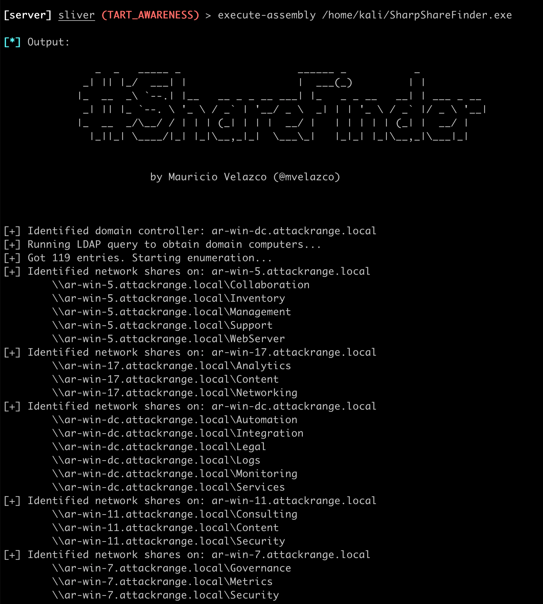

                       _  _   _____ _                   ______ _           _           
                     _| || |_/  ___| |                  |  ___(_)         | |          
                    |_  __  _\ `--.| |__   __ _ _ __ ___| |_   _ _ __   __| | ___ _ __ 
                     _| || |_ `--. \ '_ \ / _` | '__/ _ \  _| | | '_ \ / _` |/ _ \ '__|
                    |_  __  _/\__/ / | | | (_| | | |  __/ |   | | | | | (_| |  __/ |   
                      |_||_| \____/|_| |_|\__,_|_|  \___\_|   |_|_| |_|\__,_|\___|_|   
                                                                   

# SharpShareFinder

SharpShareFinder is a minimalistic network share discovery POC tool designed to enumerate shares in Windows Active Directory networks. Written in C#, it leverages .NET parallelism for efficient scanning. Initially conceived as a simulation tool for building detection rules, it may also be used for security assessments.

At its current iteration, it follows a three-step process:

1. **Domain Controller Identification**: Utilizes the DsGetDcName function from NetApi32.dll to identify a domain controller.

2. **Host Enumeration**: Uses the identified domain controller to enumerate all domain-joined computers via Lightweight Directory Access Protocol (LDAP). It leverages functions from Wldap32.dll such as ldap_init and ldap_search_st.
   
3. **Share Enumeration**: Enumerates and prints all available network shares for each identified host using the NetShareEnum API function from Netapi32.dll. 

